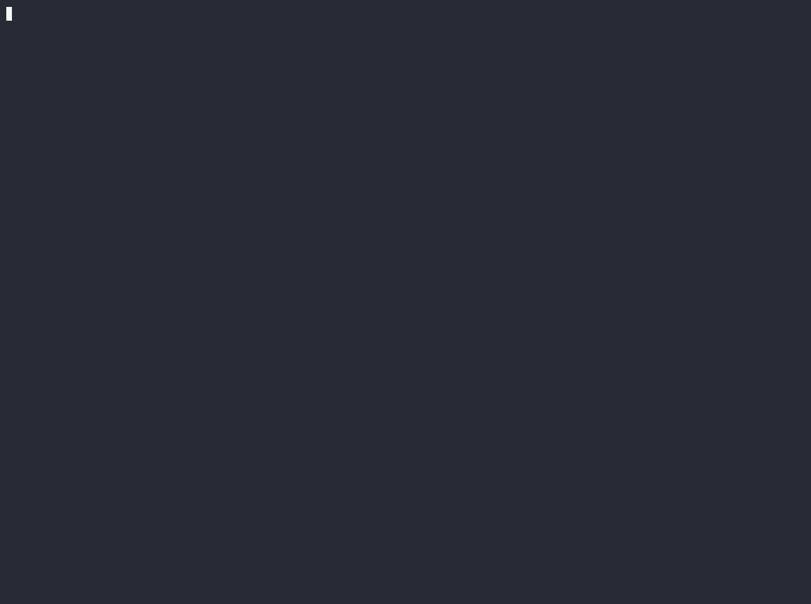

# coffer

[](https://github.com/haru0416-dev/coffer/actions/workflows/ci.yml)
[](LICENSE)


[English](README.md) | **日本語**

> ツールの結果が大きすぎて読めないとき、切り捨てずに保持する。
> coffer は元のバイト列を content store に置き、モデルには検証可能な handle を渡す。
> count / sum / max / group-by / join の質問には、全データを見て正確に答える。



**Status: experimental.** エンジンと 3 つの surface(MCP gateway・MCP server・transparent proxy)、
production 向けの smoke gate は実在し、テストも通っています。いま機械的に検証できる性質は 2 つ。
byte-exact な復元と、exact な集計です。「圧縮してもモデルの回答は保たれるのか」という accuracy の
問いは、結果より先に固定したプロトコルで扱います。圧縮率を accuracy の代わりに語ることはしません。

## 問題

`kubectl get pods -o json` を 1 回。CI の job log を 1 本。API から issue 一覧をデフォルト設定で
1 回。この程度の呼び出しが、数万から数十万 token を平気で返してきます。MCP host にはツール出力の
上限があり(多くは 25k token 前後)、超えた呼び出しは失敗するか、黙って切り捨てられるか、context を
溢れさせて以降の回答の質を落とします。いわゆる "context rot" です。

既存の対処は、どれも情報を捨てる方向を向いています。head/tail の窓が落とすのは、埋もれた答えが
載っている行そのもの。lossy な要約は、元のバイト列を二度と返せません。

## coffer がやること

payload を 1 バイトも失わずに context の外へ移す。そのうえで、計算のほうをバイト列のある場所へ
持っていく。これが coffer の仕事です。

- **Byte-exact な可逆性。** offload したバイト列は SHA-256 の content-addressed store に入り、
  モデルには短い handle と fact card だけが見えます。`reconstruct(compress(x)) == x` が byte 単位で
  成立します。Stage-0 の不変条件として property-test 済みで、読み出すたびに hash と照合するため、
  store が壊れていれば hard error になります。黙って違うバイト列を返すことはありません。落とした
  needle は、あとから回収できます。
- **Exact な compute-digest。** 「エラーは何件?」「最も restart している pod は?」「p95 は?」—
  こうした質問の答えは、生き残ったどの行にも載っていません。coffer は offload 済みの分も含めた
  全データに対して Rust で計算し、数値には裏付け行の index(provenance)を添えて返します。契約は
  refuse-rather-than-guess。型が混在する field なら、読み飛ばして集計するのではなくクエリごと
  拒否します。数千行の count や sum は frontier モデルでも間違えますが、保持したバイト列の上で
  計算すれば間違えようがありません。
- **Verifier。** `coffer_check_claim` は、エージェントが主張した数値を再計算し、AGREE / DISAGREE を
  裏付け行つきで返します。`coffer_receipt` / `coffer_verify_receipt` が発行するのは可搬な exactness
  receipt(クエリ + 値 + 行 index + 裏付け行の SHA-256)。モデルなしで再実行して検証できます。
  動くデモは `cargo run -p coffer-core --example verify` にあります。

## Surfaces — 1 つの content store、3 つの入口

- **MCP gateway(`coffer-wrap`)— 1 行で入れられる本命。** 既存の stdio MCP server を
  `coffer-wrap -- <command>` で包むだけです。大きすぎるツール結果は byte-exact に offload され、
  fact card(handle + per-field の正確な統計 + preview + 照会方法)に置き換わります。下記の照会
  ツール群は、包んだ server 自身のツールと並んで注入されます。名前が衝突しても下流のツールを
  shadow することはありません。host の上限で失敗するはずだった結果が、照会できる handle に
  変わります。冒頭の gif がこの surface の一部始終です。
- **MCP server(`coffer-mcp`)。** 出力を読み込む代わりに、server 側へ保持したまま照会するための
  ツール群。やりたいことで分けると:
  - *正確に把握する* — `coffer_describe`(行数 + per-field の統計と count-by)、`coffer_digest`
    (平易な英語で聞く exact な統計)、`coffer_aggregate`(述語つきの型付き
    `count|sum|mean|min|max`、provenance 付き)、`coffer_bucket` / `coffer_window`(数値バンド /
    N 行ブロックのヒストグラム)、`coffer_join`(保持中の 2 データセットを server 側だけで join)
  - *読まずに絞り込む* — `coffer_query` / `coffer_select`(フィルタ結果を新しい handle として
    受け取り、さらに絞れる)、`coffer_pick`(provenance の行だけ取得して数値を再検証)、
    `coffer_search` / `coffer_lines` / `coffer_rows` / `coffer_json`(ログと JSON への有界な窓)
  - *検証する* — `coffer_check_claim`、`coffer_receipt`、`coffer_verify_receipt`(前述)
  - *回収・保持する* — `coffer_retrieve` / `coffer_unfold`(有界な byte 窓、hash 検証つき)、
    `coffer_ingest`(ファイルを保持)、`coffer_run`(シェルコマンドの出力を server 側で捕捉。
    `COFFER_MCP_ENABLE_RUN=1` を立てない限り無効)、`coffer_status`
- **Transparent proxy(`coffer-proxy`)。** エージェントの base URL を向けるだけ。リクエスト内の
  大きなツール出力の値だけを書き換えます — 対象は Anthropic Messages の `tool_result`、OpenAI
  Responses の `*_call_output`、Ollama `/api/chat` の tool メッセージ。system / user / assistant の
  書かれたテキストと prompt-cache の prefix には触れません。書き換えた各ブロックの先頭には 1 行の
  explainer が付くので、`<<cof:…>>` マーカーが破損と誤解されることもありません。fail-open で、
  想定外のものはすべて素通しです。

3 つの入口は 1 つの content store を共有します。proxy が圧縮したものも、gateway が offload した
ものも、MCP server から回収と照会ができます。

## 正直さを、先に

context 圧縮ツールの多くは、圧縮率と accuracy を別々のデータセットで測り、いちばん有利な条件だけを
報告します。coffer はその逆をやると、結果より先にプロトコルとして決めています。

- **同一ワークロードでの end-task accuracy** を複数の圧縮率で測る。regime と content type ごとに
  accuracy-vs-compression の曲線を出す。
- 決定的な比較相手は、**同じ token 予算での naive な head/tail truncation**。安い baseline に並ばれた
  ワークロードでは、並ばれたと書く。
- 有利な裾ではなく、**負けうる典型的な regime** を報告する。
- token は**対象モデル自身の tokenizer**で数える。**retrieval の往復 token も数える**。byte 忠実な
  round-trip の検証は、accuracy とは分けて報告する。

このうち 2 つは機械的な約束で、API キーなしで再現できます。`cargo run --release -p coffer-eval` が、
5,000 pod の `kubectl` dump(o200k で約 229k token)に対して次の表を再生成します。token のカウントは
モデル自身の tokenizer です。

| compression | byte-exact round-trip | coffer answer error | head/tail truncation error at the same budget (count · sum · argmax) |
|------------:|:---------------------:|:-------------------:|:---------------------------------------------------------------------|
| 33% | ✅ | **0.00%** | 33% · 34% · ❌ buried needle missed |
| 67% | ✅ | **0.00%** | 68% · 61% · ❌ buried needle missed |
| 87% | ✅ | **0.00%** | 87% · 83% · ❌ buried needle missed |
| 93% | ✅ | **0.00%** | 93% · 91% · ❌ buried needle missed |
| 97% | ✅ | **0.00%** | 98% · 96% · ❌ buried needle missed |

coffer の回答は offload 済みの分も含めた全バイトから計算し、独立に算出した ground truth との一致を
assert しています。だから誤差は全レベルで 0.00% です。表の数値は同じ token 予算での *truncation*
baseline の誤差で、「窓に見えている行を完璧に集計できた場合」という甘めの見積もり。実際のモデルは
それ以上の行を見られず、計算も苦手なので、これは baseline の上限にあたります。exact な回答の取得
コストは、dump のサイズによらず retrieval 約 20 token。truncation が常に悪いわけでもありません。
mean のようなサンプリングに強い統計なら数%以内に収まります。coffer が勝つのは、窓が落とした行に
答えが依存する場合 — count、sum、埋もれた極値 — で、harness は勝てない mean の列もそのまま
出します。

エンジン自体のデモも同じ流儀です。5.7 MB の kubectl 形状の dump を、実測の `o200k_base` で
2,170,329 → 216,857 token まで削り、byte 単位で再構築します(`cmp` を画面上で実行):


残っている約束がひとつあります。**実モデルでの end-task accuracy** を、複数の圧縮率で、同じ
truncation baseline と比べること。上の harness では決着しません。証明できているのは 2 つの機械的
性質(byte-exact round-trip と exact な集計)であって、「LLM の回答が良くなる」ことではないから
です。この仮説が kill-probe で否定されたら、失敗した曲線も公開します。それはそれで有用な結果です。

coffer が**勝たない**場面も書いておきます。frontier モデルの context window に収まる普通の
retrieval では、圧縮しても生のまま渡すのに勝てません。並ぶだけです。code 実行エージェントも、
自分でコードを書けば同じ exact な集計を出せます。accuracy では引き分けで、coffer の勝ちでは
ありません。言葉にする価値のある差分はもっと狭いところにあります。coffer はバイト列がモデルに
届く前の transport 層で動くこと。sandbox も codegen の往復も要らないこと。元のバイト列を、
すべて回収可能なまま保つこと。

## Quickstart

```sh
# ビルド済みバイナリ(linux x86_64/aarch64, macOS x86_64/aarch64, windows x86_64):
#   https://github.com/haru0416-dev/coffer/releases — sha256 チェックサム付き。
# またはソースからインストール(Rust toolchain が必要):
cargo install --git https://github.com/haru0416-dev/coffer coffer-wrap --locked
# (coffer-mcp / coffer-proxy も同様)

# MCP gateway — context を溢れさせる server を包む(任意の stdio MCP server、任意の MCP host)。
# 実例: host の MCP 設定で、公式 filesystem server を包む場合:
#   "command": "coffer-wrap",
#   "args": ["npx", "-y", "@modelcontextprotocol/server-filesystem", "/path/to/allow"]

# MCP server — 出力を handle で保持し、正確に照会する:
coffer-mcp

# Transparent proxy — 飛んでいく tool_result ブロックを圧縮する:
coffer-proxy
ANTHROPIC_BASE_URL=http://127.0.0.1:8788   # COFFER_PROXY_UPSTREAM の既定は api.anthropic.com
```

どれにも `COFFER_CAS_DB=/path/to/cas.db` を設定すると、1 つの永続 store をプロセス間で共有できます。
gateway や proxy が offload したものを、MCP server 側から回収・照会する構成です。production 向けの
配線は [`docs/deployment.md`](docs/deployment.md) にまとめてあります。

npm launcher の scaffold は [`npm/`](npm/) にあります。公開されれば `npx coffer coffer-mcp` で
プラットフォーム別のバイナリが動く想定ですが、**まだ npm registry には公開していません**。当面は
release バイナリか、上記のソースビルドを使ってください。

デフォルトは安全側です。proxy は `COFFER_PROXY_ALLOW_PUBLIC=1` を立てない限り loopback 以外への
bind を拒否します(認証を持たず、upstream の key を中継するため)。MCP の `coffer_run` シェル
ツールも `COFFER_MCP_ENABLE_RUN=1` がなければ動きません。

## Layout

- `crates/` — エンジン(`coffer-core`)、content store(`coffer-cas`)、tokenizer-parity カウント
  (`coffer-tokenizer`)、MCP server(`coffer-mcp`)、MCP gateway(`coffer-wrap`)、transparent
  proxy(`coffer-proxy`)、再現可能ベンチマーク(`coffer-eval`、上の表 — `cargo run --release -p
  coffer-eval`)。
- [`docs/DESIGN.md`](docs/DESIGN.md) — 設計と仕様。可逆性の不変条件、データモデル、圧縮
  パイプライン、budget search、compute-digest、surfaces、non-goals。
- [`docs/deployment.md`](docs/deployment.md) — MCP/proxy のデプロイ、shared-CAS の配線、制限事項。
- [`demo/`](demo/README.md) — 上の 2 本の gif。実コマンドから再現できる方法で収録。

*このファイルは [README.md](README.md)(英語)の翻訳です。内容が食い違ったときは英語版を正と
します。*

## License

Apache-2.0。[`LICENSE`](LICENSE) を参照。
